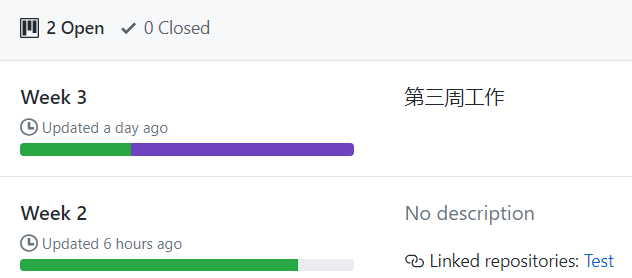
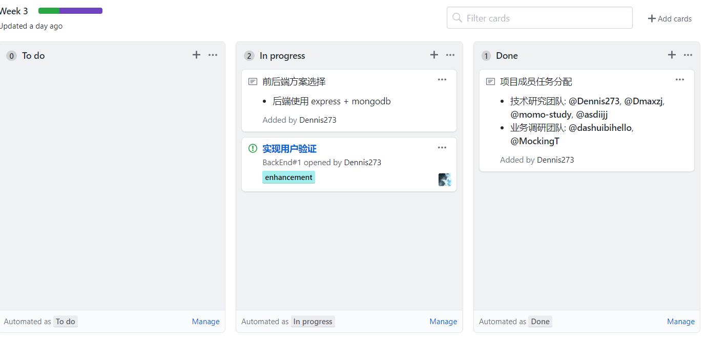
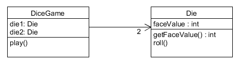

# Week2 软件项目与知识团队管理基础

---

1. 简答题

    > 用简短的语言给出对分析、设计的理解。

    **分析**即考虑项目需求，包括项目的目的是要做什么、哪些部分比较重要，哪些地方可以执行，哪些地方无法做到等。

    **设计**即针对分析之后的项目需求，找出满足需求、解决问题的方法，并且规划整个开发的流程。即考虑该怎么做这件事。

    ---

    > 用一句话描述面向对象的分析与设计的优势。

    优势是对现实中的对象进行结构化、抽象化，使得问题分析与编程实现分离，有助于没有编程知识的人也能够通过通用的符号进行交流。

    ---

    > 简述 UML（统一建模语言）的作用。考试考哪些图？

    - UML能用于吧现实中的问题抽象成面向对象的解决方案，以便进一步的编程；

    - UML使得系统的建模过程标准化，统一化和规范化；

    - UML采用图形化的表现形式，使得构造模型便于理解，易于开发人员与用户的沟通，也易于非专业的编程人员也能直白地理解项目构造；

    - UML通常包括用例图、类图、对象图、状态转换图、活动图、时序图、部署图，包图等。

    - 考试会考用例图、静态图、行为图、实现图。

    ---

    > 从软件本质的角度，解释软件范围（需求）控制的可行性

    一般而言，软件具有复杂性（complexity）、一致性（conformity）、可变性（changeability）、不可视性（invisibility）的特性，这是决定了软件开发困难的本质特性。

    项目的首要约束为工期、预算、质量、范围四个基本要素，了解并控制这四个要素，就是软件需求控制的关键。

    - 工期，软件项目刚性约束。多数情况下，软件的按时投产意味着收益或成本降低；

    - 预算，软件项目重要约束。它与工期一样，最容易观察与度量，所以没有特别情况也不宜超预算；

    - 质量，软件质量通常是有底线的。一些指标如可靠性、性能等，比较难以商量；另一些指标如易用性似乎相对灵活，但用户满意度对此特别敏感；

    - 范围，在多数情况下，客户与开发者能就项目的 20% 内容给出严格的需求约定，80% 的内容都是相对模糊的。因此，围绕客户目标，发现并满足客户感兴趣的内容是最关键的。

    ---

2. 项目管理实践

    - 看板

        

        

    - UML绘图

        
