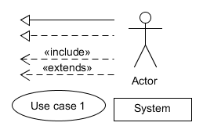
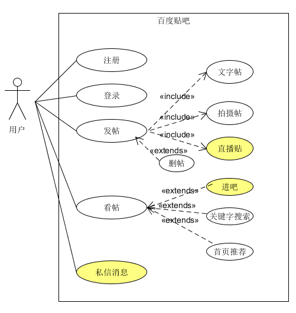
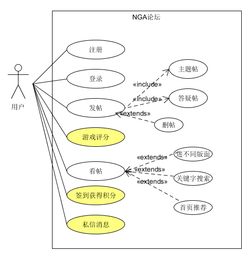

# Week6 用例建模 - 绘制用例图

1. 简答题

    > 用例的概念

    用例，Use Case，即一个或一组场景，其描述的对象是用户。

    ---

    > 用例和场景的关系？什么是主场景或 happy path？

    用例是包括主场景和各种可选场景的一系列场景；主场景即最常用的、直接实现用户目标的场景，一般是成功的，因此为 "happy path"。

    ---

    > 用例有哪些形式？

    - 简短（Brief）：简短的一段总结，通常是主要的成功场景。

    - 非正式（Casual）：非正式段落格式，涵盖各种场景的多个段落。

    - 全面（Fully）：详细描述所有步骤和变化，并有支持部分，如先决条件和成功保证。

    ---

    > 对于复杂业务，为什么编制完整用例非常难？

    复杂业务会有更多的场景，各场景之间关系复杂、联系不明，使得要编制相应的完整用例非常难。
    
    ---

    > 什么是用例图？

    用例图是指由参与者（Actor）、用例（Use Case），边界以及它们之间的关系构成的用于描述系统功能的视图。

    构建用例图利于描述系统场景间的关系，是系统结构基本蓝图。
    
    ---

    > 用例图的基本符号与元素？

    基本符号：

    

    元素：
    - 用例
    - 参与者
    - 关联关系
    - 包含关系
    - 扩展关系
    - 泛化关系
    
    ---

    > 用例图的画法与步骤

    - 画出系统框架，写上系统名；

    - 确定参与者（Actor），包括用户群、系统开发人员、维护人员、与系统相关的其他人员等；

    - 识别用例，包括从系统功能角度考虑的及用户角度考虑的；

    - 用四种箭头描述参与者之间、用例之间、参与者与用例之间的关系。

    - 用例画在系统里面，如果有涉及其它子系统的功能，子系统放在系统的右边。
    
    ---

    > 用例图给利益相关人与开发者的价值有哪些？

    - 利益相关人可直观地看到程序系统的基本框架，方便以专业外的角度提出意见；

    - 用例图是设计人员与开发人员的交流工具；

    - 用例图是系统的基本框架，利于开发最后的整合过程。

    ---

2. 建模练习题

    选取两个论坛类APP——百度贴吧和NGA游戏论坛，绘制UML图：

    

    

    > 为什么相似系统的用例图是相似的？

    因为用户需求相似，场景也相似，因此用例是相似的。

    ---

    > 如果是定旅馆业务，请对比 Asg_RH 用例图，简述如何利用不同时代、不同地区产品的用例图，展现、突出创新业务和技术

    非订旅馆业务。

    ---

    > 如何利用用例图定位创新思路（业务创新、或技术创新、或商业模式创新）在系统中的作用

    一般可用彩色用例来标注创新模块。而如果该创新用例与用户Actor相关，则其比较重要；如果用例是extend关系，则其作用在系统中并不十分重要，可延后实现。

    ---

    > 请使用 SCRUM 方法，选择一个用例图，编制某定旅馆开发的需求（backlog）开发计划表

    Asg_RH：

    | ID | Name | Imp | Est | How to demo|
    |:-:|:-:|:-:|:-:|:-:|
    | 1 | 查找酒店 | 20 | 4 | 根据地图信息查找酒店 |
    | 2 | 预订酒店 | 15 | 3 | 选择酒店，房间，入住时间；预订 |
    | 3 | 查询 | 10 | 3 | 根据设定条件查找酒店 |
    | 4 | 付款 | 20 | 6 | 通过外部系统付款 |
    | 5 | 管理订单 | 15 | 5 | 增删查订单 |
    | 6 | 管理账户 | 10 | 3 | 管理用户的账户信息 |

    ---

    > 根据任务4，参考 使用用例点估算软件成本，给出项目用例点的估算

    | 用例 | #业务 | #计算 | 原因 | UC权重 |
    |:-:|:-:|:-:|:-:|:-:|
    | 查找酒店 | 3 | 2 |  | 简单 |
    | 预订酒店 | 6 | 4 |  |  简单|
    | 查询 | 3 | 2 |  | 平均 |
    | 付款 | 1 | 1 |  | 简单 |
    | 管理订单 | 4 | 3 |  | 简单 |
    | 管理账户 | 4 | 3 |  | 简单 |
